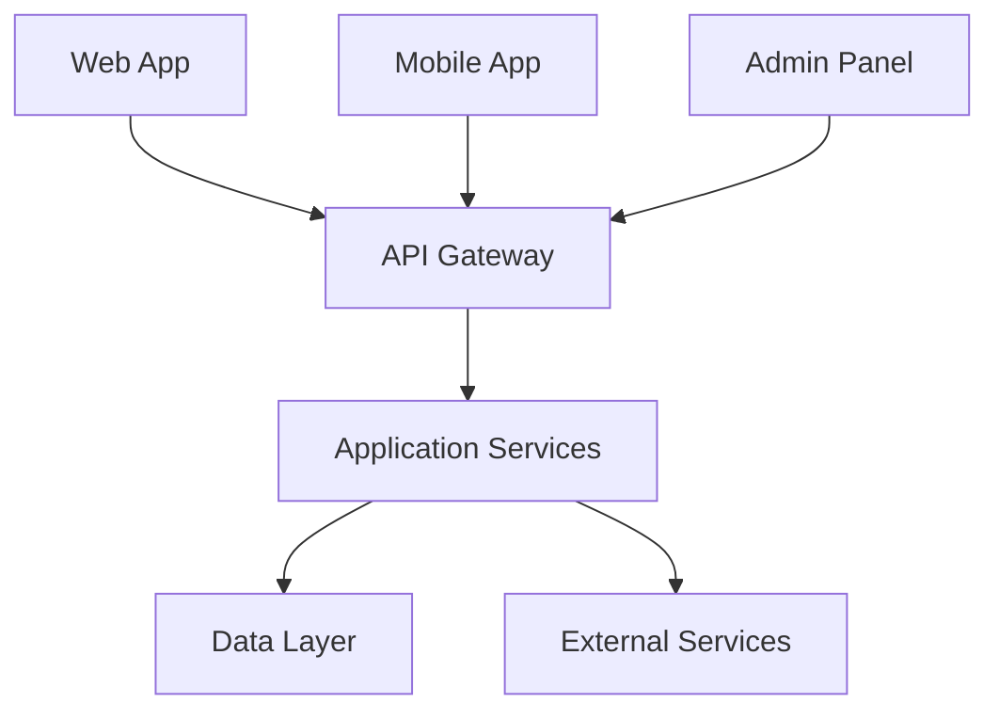
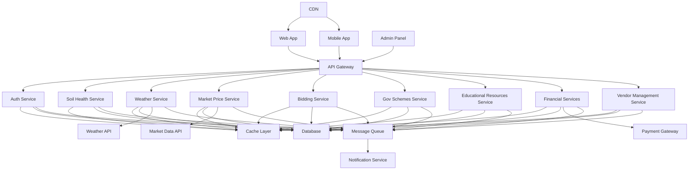

# Krishi Mitra (Farm Friend) Project

## Table of Contents
1. [Introduction](#introduction)
2. [System Architecture](#system-architecture)
   - [L1 Diagram](#l1-diagram)
   - [L2 Diagram](#l2-diagram)
3. [Technology Stack](#technology-stack)
4. [Core Services](#core-services)
5. [Data Management](#data-management)
6. [Security](#security)
7. [Scalability and Performance](#scalability-and-performance)
8. [Development Setup](#development-setup)
9. [Deployment](#deployment)
10. [Testing](#testing)
11. [Monitoring and Logging](#monitoring-and-logging)
12. [Future Enhancements](#future-enhancements)
13. [Contributing](#contributing)
14. [License](#license)

## Introduction

Krishi Mitra (Farm Friend) is a comprehensive digital platform designed to revolutionize farming practices in India. This Public-Private Partnership (PPP) model application aims to empower farmers with real-time information, tools, and resources to enhance agricultural productivity, sustainability, and profitability.

Key Features:
- Weather and Climate Information
- Soil Health Monitoring
- Crop Management Tools
- Market Price Discovery
- Financial Services
- Bidding and Transaction Facilitation
- Vendor Management
- Educational Resources

## System Architecture

### L1 Diagram

The high-level architecture of Krishi Mitra is designed for scalability, maintainability, and efficiency.



### L2 Diagram

The detailed architecture breaks down each component into specific services and shows their interactions.



### Architecture Decisions

1. **Microservices Architecture**: We chose a microservices architecture to allow for independent scaling, development, and deployment of services. This improves fault isolation and enables the use of different technologies per service if needed.

2. **API Gateway**: Implemented to provide a single entry point for all client requests, offering better security, load balancing, and easier versioning of APIs.

3. **Caching Layer**: A distributed cache improves performance and reduces load on the database, especially for frequently accessed data like weather information or market prices.

4. **Shared Database**: While separate databases per service is often recommended for microservices, we opted for a shared database to simplify data consistency and reduce operational complexity at this stage. As the system grows, we can migrate to separate databases if needed.

5. **Message Queue**: Used for asynchronous communication between services and to trigger the Notification Service, allowing for better decoupling of services, improved scalability, and reliable delivery of messages.

6. **CDN**: Implemented to serve static assets for the Web and Mobile apps, improving load times, reducing bandwidth costs, and increasing availability and redundancy.

7. **External APIs**: Integrated for specialized data (weather, market prices) to provide more accurate and up-to-date information without the overhead of maintaining our own data collection systems.

8. **Payment Gateway**: Used for handling financial transactions in the Financial Services, ensuring security and compliance with financial regulations.

9. **Centralized Notification Service**: Ensures consistent notification management across all channels and allows for easier implementation of new notification channels.

## Technology Stack

- **Frontend**:
  - Web App: React with TypeScript
  - Mobile App: React Native
  - Admin Panel: React with TypeScript

- **Backend**:
  - API Gateway: Kong
  - Microservices: Node.js with Express.js
  - Database: PostgreSQL
  - Cache: Redis
  - Message Queue: RabbitMQ
  - Search Engine: Elasticsearch (for Educational Resources and Gov Schemes)

- **DevOps**:
  - Containerization: Docker
  - Orchestration: Kubernetes
  - CI/CD: Jenkins
  - Monitoring: Prometheus and Grafana
  - Logging: ELK Stack (Elasticsearch, Logstash, Kibana)

## Core Services

1. **Auth Service**: Handles user authentication and authorization.
2. **Soil Health Service**: Manages soil testing data and provides recommendations.
3. **Weather Service**: Integrates with external weather APIs and provides localized forecasts.
4. **Market Price Service**: Manages and provides real-time market prices for various crops.
5. **Bidding Service**: Facilitates the online bidding system for crops.
6. **Gov Schemes Service**: Manages information about government schemes and subsidies.
7. **Educational Resources Service**: Provides access to farming tutorials, articles, and videos.
8. **Financial Services**: Handles loans, insurance products, and integrates with payment gateways.
9. **Vendor Management Service**: Manages the directory of suppliers and buyers.

## Data Management

- **Database**: PostgreSQL is used as the primary database for its robustness and support for complex queries.
- **Caching**: Redis is implemented for caching frequently accessed data, reducing database load.
- **Data Consistency**: Implemented through database transactions and distributed locks where necessary.
- **Backup and Recovery**: Regular automated backups with point-in-time recovery capability.

## Security

- **Authentication**: JWT-based authentication with refresh token mechanism.
- **Authorization**: Role-based access control (RBAC) implemented across all services.
- **Data Encryption**: All sensitive data is encrypted at rest and in transit.
- **API Security**: Rate limiting, IP whitelisting, and OAuth 2.0 for third-party integrations.
- **Regular Security Audits**: Scheduled penetration testing and vulnerability assessments.

## Scalability and Performance

- **Horizontal Scaling**: All services are designed to be stateless, allowing for easy horizontal scaling.
- **Load Balancing**: Implemented at the API Gateway level and for individual services.
- **Database Scaling**: Read replicas for improved read performance, with the option to shard in the future if needed.
- **Caching Strategy**: Multi-level caching with application-level caching and a distributed cache (Redis).
- **Asynchronous Processing**: Non-critical operations are handled asynchronously using message queues.

## Development Setup

1. Clone the repository:
   ```
   git clone https://github.com/krishimitra/farm-friend.git
   cd farm-friend
   ```

2. Install dependencies:
   ```
   npm install
   ```

3. Set up environment variables:
   ```
   cp .env.example .env
   # Edit .env file with your configuration
   ```

4. Start the development server:
   ```
   npm run dev
   ```

Refer to the `CONTRIBUTING.md` file for coding standards and contribution guidelines.

## Deployment

We use a Kubernetes-based deployment strategy:

1. Build Docker images for each service.
2. Push images to a container registry.
3. Apply Kubernetes manifests to deploy services, configmaps, and secrets.
4. Use Helm charts for managing complex deployments.

Detailed deployment instructions can be found in the `deployment/` directory.

## Testing

- **Unit Testing**: Jest for backend services, React Testing Library for frontend.
- **Integration Testing**: Supertest for API integration tests.
- **End-to-End Testing**: Cypress for web app, Detox for mobile app.
- **Load Testing**: Apache JMeter for performance testing.
- **Continuous Testing**: Integrated with CI/CD pipeline.

Run tests with:
```
npm run test
```

## Monitoring and Logging

- **Metrics Monitoring**: Prometheus for collecting metrics, Grafana for visualization.
- **Log Management**: ELK Stack (Elasticsearch, Logstash, Kibana) for centralized logging.
- **Alerts**: Set up in Grafana with integration to PagerDuty for critical alerts.
- **Performance Monitoring**: New Relic for application performance monitoring.

## Future Enhancements

1. Implement machine learning models for crop yield prediction and pest detection.
2. Develop a blockchain-based solution for supply chain traceability.
3. Integrate IoT devices for automated soil health monitoring and irrigation control.
4. Implement a recommendation engine for personalized farming advice.
5. Develop a mobile app feature for offline access to critical information.

## Contributing

We welcome contributions to Krishi Mitra! Please read our `CONTRIBUTING.md` file for guidelines on how to make contributions.

## License

This project is licensed under the MIT License - see the `LICENSE.md` file for details.

---

For any questions or support, please contact our team at support@krishimitra.com.
