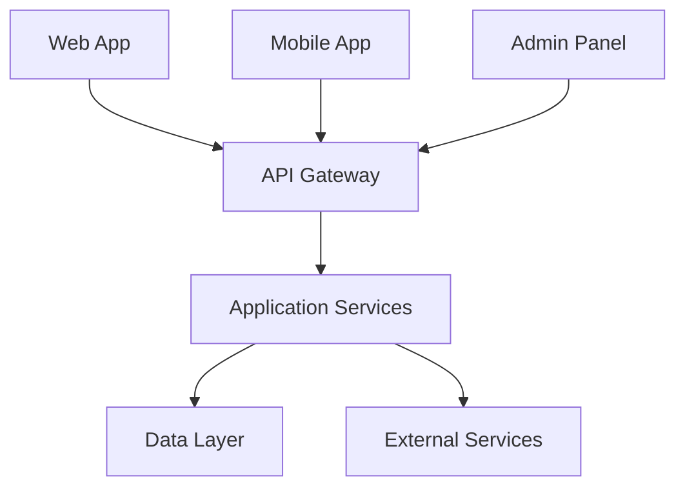
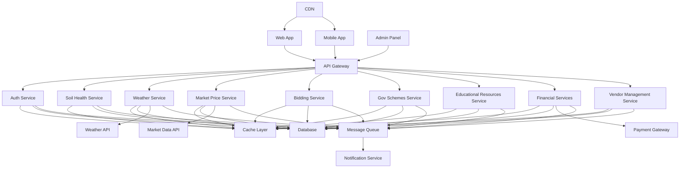
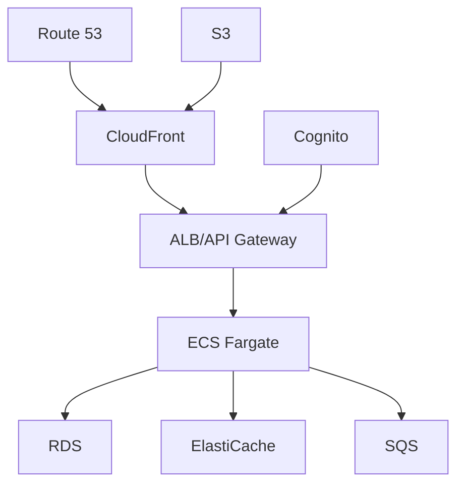
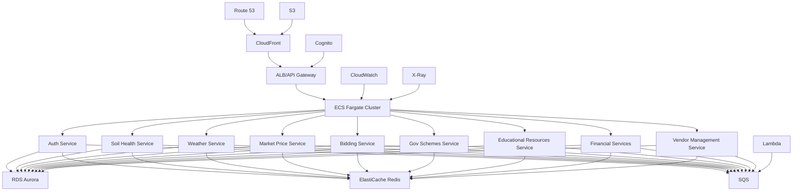

# Krishi Mitra (Farm Friend) Project

## Table of Contents
1. [Introduction](#1-introduction)
2. [System Architecture](#2-system-architecture)
3. [AWS Deployment Architecture](#3-aws-deployment-architecture)
4. [Technology Stack](#4-technology-stack)
5. [Core Services](#5-core-services)
6. [Data Management](#6-data-management)
7. [Security](#7-security)
8. [Scalability and Performance](#8-scalability-and-performance)
9. [Development Setup](#9-development-setup)
10. [Deployment](#10-deployment)
11. [Testing](#11-testing)
12. [Monitoring and Logging](#12-monitoring-and-logging)
13. [Cloud Budget Estimation](#13-cloud-budget-estimation)
14. [Disaster Recovery Strategy](#14-disaster-recovery-strategy)
15. [CAP Theorem Considerations](#15-cap-theorem-considerations)
16. [Compliance and Data Governance](#16-compliance-and-data-governance)
17. [Performance Optimization](#17-performance-optimization)
18. [Future Enhancements](#18-future-enhancements)
19. [Contributing](#19-contributing)
20. [License](#20-license)

## 1. Introduction

Krishi Mitra (Farm Friend) is a comprehensive digital platform designed to revolutionize farming practices in India. This Public-Private Partnership (PPP) model application aims to empower farmers with real-time information, tools, and resources to enhance agricultural productivity, sustainability, and profitability.

Key Features:
- Weather and Climate Information
- Soil Health Monitoring
- Crop Management Tools
- Market Price Discovery
- Financial Services
- Bidding and Transaction Facilitation
- Vendor Management
- Educational Resources

## 2. System Architecture

### L1 Diagram

The high-level architecture of Krishi Mitra is designed for scalability, maintainability, and efficiency.



### L2 Diagram

The detailed architecture breaks down each component into specific services and shows their interactions.



### Architecture Decisions

1. **Microservices Architecture**
   - Decision: Adopt a microservices-based architecture.
   - Justification: Enables independent scaling, deployment, and technology choices for each service. Improves fault isolation and allows for easier maintenance and updates.
   - Alternatives Considered:
     a. Monolithic Architecture: Rejected due to lack of scalability and flexibility.
     b. Service-Oriented Architecture (SOA): Rejected as it's typically more heavyweight and less agile than microservices.

2. **API Gateway**
   - Decision: Implement an API Gateway as the single entry point for all client requests.
   - Justification: Provides a unified interface for clients, enables better security control, load balancing, and easier API versioning.
   - Alternatives Considered:
     a. Direct Client-to-Microservice Communication: Rejected due to increased complexity in client-side code and potential security risks.

3. **Event-Driven Architecture**
   - Decision: Implement event-driven communication between services using a message queue.
   - Justification: Allows for loose coupling between services, improves scalability, and enables real-time updates.
   - Alternatives Considered:
     a. Synchronous REST-based Communication: Rejected due to tight coupling and potential performance issues under high load.

4. **Polyglot Persistence**
   - Decision: Use different types of databases for different services based on their data model and query patterns.
   - Justification: Allows each service to use the most appropriate database for its needs, optimizing performance and scalability.
   - Alternatives Considered:
     a. Single Relational Database: Rejected due to potential bottlenecks and lack of flexibility for different data models.

5. **Caching Strategy**
   - Decision: Implement a multi-level caching strategy with application-level caching and a distributed cache.
   - Justification: Improves application performance, reduces database load, and enhances user experience with faster response times.
   - Alternatives Considered:
     a. No Caching: Rejected due to potential performance issues and unnecessary load on the database.
     b. Database-level Caching Only: Rejected as it doesn't provide the flexibility and performance benefits of a multi-level approach.

6. **Authentication and Authorization**
   - Decision: Implement JWT-based authentication with a refresh token mechanism and role-based access control (RBAC).
   - Justification: Provides secure, stateless authentication that works well with microservices architecture. RBAC allows for fine-grained access control.
   - Alternatives Considered:
     a. Session-based Authentication: Rejected due to scalability issues in a distributed system.
     b. OAuth 2.0 with OpenID Connect: Considered for future implementation for third-party integrations.

7. **Containerization and Orchestration**
   - Decision: Use Docker for containerization and Kubernetes for orchestration.
   - Justification: Ensures consistency across development and production environments, facilitates easy scaling and management of microservices.
   - Alternatives Considered:
     a. Virtual Machines: Rejected due to higher resource overhead and slower deployment times.
     b. Docker Swarm: Rejected in favor of Kubernetes' more robust feature set and wider adoption.

## 3. AWS Deployment Architecture

### AWS L1 Diagram



### AWS L2 Diagram



### AWS Deployment Strategy

1. **DNS and Content Delivery**
   - Use Route 53 for DNS management and CloudFront for content delivery, ensuring low-latency access globally.

2. **Load Balancing and API Management**
   - Implement Application Load Balancer (ALB) for load balancing across services.
   - Consider using API Gateway for advanced API management features.

3. **Compute**
   - Deploy microservices on ECS Fargate for serverless container management, reducing operational overhead.

4. **Database**
   - Utilize Amazon RDS Aurora for relational data, leveraging its high availability and scalability features.
   - Consider DynamoDB for services requiring NoSQL capabilities.

5. **Caching**
   - Implement ElastiCache Redis for distributed caching, improving application performance.

6. **Message Queue**
   - Use Amazon SQS for reliable, scalable message queuing between services.

7. **Storage**
   - Employ S3 for object storage, storing static assets, backups, and large datasets.

8. **Authentication**
   - Integrate Amazon Cognito for user authentication and authorization.

9. **Serverless Computing**
   - Utilize Lambda for event-driven processing and background tasks.

10. **Monitoring and Logging**
    - Implement CloudWatch for centralized monitoring and logging.
    - Use X-Ray for distributed tracing and performance analysis.

11. **Security**
    - Employ WAF for protection against web exploits.
    - Utilize KMS for encryption key management.
    - Implement VPC for network isolation.

This AWS-based architecture leverages managed services to reduce operational overhead, improve scalability, and enhance security. It aligns well with the microservices architecture of Krishi Mitra, providing a robust and scalable cloud infrastructure.

## 4. Technology Stack

- **Frontend**:
  - Web App: React 18 with TypeScript 4
  - Mobile App: React Native
  - Admin Panel: React 18 with TypeScript 4
  - State Management: Redux Toolkit
  - UI Framework: Material-UI

- **Backend**:
  - API Gateway: AWS API Gateway
  - Microservices: Node.js 14+ with Express.js
  - Database: Amazon RDS Aurora (PostgreSQL compatible)
  - Cache: Amazon ElastiCache for Redis
  - Message Queue: Amazon SQS
  - Search Engine: Amazon Elasticsearch Service

- **DevOps**:
  - Containerization: Docker
  - Orchestration: Amazon ECS with Fargate
  - CI/CD: AWS CodePipeline, CodeBuild, and CodeDeploy
  - Infrastructure as Code: AWS CloudFormation
  - Monitoring: Amazon CloudWatch, X-Ray
  - Logging: Amazon CloudWatch Logs

## 5. Core Services

1. **Auth Service**: Handles user authentication and authorization using JWT and integrates with Amazon Cognito.
2. **Soil Health Service**: Manages soil testing data and provides recommendations using machine learning models.
3. **Weather Service**: Integrates with external weather APIs and provides localized forecasts using caching for performance.
4. **Market Price Service**: Manages and provides real-time market prices for various crops, utilizing websockets for live updates.
5. **Bidding Service**: Facilitates the online bidding system for crops, implementing a CQRS pattern for scalability.
6. **Gov Schemes Service**: Manages information about government schemes and subsidies, utilizing Elasticsearch for efficient searching.
7. **Educational Resources Service**: Provides access to farming tutorials, articles, and videos, leveraging CDN for content delivery.
8. **Financial Services**: Handles loans, insurance products, and integrates with payment gateways, implementing the Saga pattern for distributed transactions.
9. **Vendor Management Service**: Manages the directory of suppliers and buyers, utilizing graph database capabilities for relationship mapping.

## 6. Data Management

- **Database**: Amazon RDS Aurora (PostgreSQL compatible) is used as the primary database, leveraging its high availability and scalability features.
- **Caching**: Amazon ElastiCache for Redis is implemented for distributed caching, reducing database load and improving response times.
- **Data Consistency**: Implemented through database transactions and distributed locks using Redis, ensuring data integrity across microservices.
- **Backup and Recovery**: Automated backups using AWS Backup with point-in-time recovery capability.
- **Data Warehousing**: Amazon Redshift for analytical queries and big data processing.

## 7. Security

- **Authentication**: JWT-based authentication with refresh token mechanism, integrated with Amazon Cognito for identity management.
- **Authorization**: Fine-grained access control using AWS IAM roles and policies.
- **Data Encryption**: All sensitive data is encrypted at rest using AWS KMS and in transit using TLS.
- **API Security**: Implemented rate limiting, IP whitelisting, and OAuth 2.0 for third-party integrations using AWS WAF and API Gateway.
- **Network Security**: VPC configuration with private subnets, security groups, and NACLs to control inbound and outbound traffic.
- **Compliance**: Regular security audits and penetration testing to ensure compliance with industry standards (e.g., ISO 27001, GDPR).

## 8. Scalability and Performance

- **Horizontal Scaling**: ECS with Fargate allows for easy horizontal scaling of services based on demand.
- **Auto Scaling**: Implemented at both the application (ECS) and database (Aurora) levels to handle varying loads.
- **Load Balancing**: Application Load Balancer (ALB) distributes traffic across multiple instances of each service.
- **Database Scaling**: Aurora's read replicas for improved read performance, with the option to use global database for multi-region deployments.
- **Caching Strategy**: Multi-level caching with ElastiCache Redis and application-level caching to reduce database load and improve response times.
- **Content Delivery**: CloudFront CDN for efficient delivery of static assets and content.
- **Asynchronous Processing**: SQS and Lambda for handling background tasks and event-driven processes.

## 9. Development Setup

1. Clone the repository:
   ```
   git clone https://github.com/krishimitra/farm-friend.git
   cd farm-friend
   ```

2. Install dependencies:
   ```
   npm install
   ```

3. Set up environment variables:
   ```
   cp .env.example .env
   # Edit .env file with your configuration
   ```

4. Start the development server:
   ```
   npm run dev
   ```

Refer to the `CONTRIBUTING.md` file for coding standards and contribution guidelines.

## 10. Deployment

We use an AWS-based deployment strategy leveraging Infrastructure as Code:

1. Define infrastructure using AWS CloudFormation templates.
2. Set up CI/CD pipeline using AWS CodePipeline:
   - Source: AWS CodeCommit or GitHub
   - Build: AWS CodeBuild (Docker image creation)
   - Test: Automated testing in CodeBuild
   - Deploy: AWS CodeDeploy to ECS Fargate
3. Use AWS Systems Manager Parameter Store for managing environment variables and secrets.
4. Implement Blue/Green deployment strategy for zero-downtime updates.

Detailed deployment instructions can be found in the `deployment/` directory.

## 11. Testing

- **Unit Testing**: Jest for backend services, React Testing Library for frontend.
- **Integration Testing**: Supertest for API integration tests.
- **End-to-End Testing**: Cypress for web app, Detox for mobile app.
- **Load Testing**: Apache JMeter for performance testing.
- **Continuous Testing**: Integrated with CI/CD pipeline.

Run tests with:
```
npm run test
```

## 12. Monitoring and Logging

- **Metrics Monitoring**: Amazon CloudWatch for collecting and visualizing metrics.
- **Log Management**: CloudWatch Logs for centralized logging, with log insights for analysis.
- **Distributed Tracing**: AWS X-Ray for end-to-end tracing of requests across microservices.
- **Alerts**: CloudWatch Alarms with integration to SNS for notifications.
- **Performance Monitoring**: AWS X-Ray for application performance monitoring and bottleneck identification.
- **Cost Monitoring**: AWS Cost Explorer and Budgets for tracking and optimizing cloud spending.
- **Custom Dashboards**: Create custom CloudWatch dashboards for holistic system overview.
- **Anomaly Detection**: Utilize CloudWatch Anomaly Detection to automatically identify unusual patterns.
- **Log Retention**: Implement log retention policies to balance between data availability and storage costs.

## 13. Cloud Budget Estimation

Estimating the cloud budget for Krishi Mitra involves considering various AWS services and usage patterns. Here's a rough monthly estimate based on moderate usage:

1. **Compute (ECS Fargate)**: $2,000 - $3,000
   - Assumes 50-100 tasks running continuously

2. **Database (RDS Aurora)**: $1,000 - $1,500
   - Includes multi-AZ deployment for high availability

3. **Caching (ElastiCache)**: $300 - $500
   - Cluster with 3 nodes for redundancy

4. **Storage (S3 and EBS)**: $200 - $400
   - Includes data storage and backups

5. **Content Delivery (CloudFront)**: $200 - $400
   - Assumes moderate traffic for static asset delivery

6. **Networking**: $300 - $500
   - Includes data transfer and VPC costs

7. **Monitoring and Logging**: $200 - $300
   - CloudWatch, X-Ray, and log storage

8. **Security Services**: $100 - $200
   - WAF, KMS, and other security features

9. **Miscellaneous Services**: $200 - $400
   - Includes SQS, SNS, Cognito, etc.

**Total Estimated Monthly Cost**: $4,500 - $7,200

Note: This is a rough estimate and actual costs may vary based on usage patterns, data volume, and specific implementation details. It's recommended to use AWS Cost Explorer and set up detailed billing alerts to monitor and optimize costs continuously.

### Cost Optimization Strategies:
1. Use AWS Savings Plans or Reserved Instances for predictable workloads.
2. Implement auto-scaling to match resource allocation with demand.
3. Utilize spot instances for non-critical, fault-tolerant workloads.
4. Regularly review and delete unused resources.
5. Optimize data transfer to minimize cross-region traffic.
6. Use S3 Intelligent-Tiering for optimal storage cost management.
7. Implement lifecycle policies for S3 to automatically move or delete objects.
8. Utilize Aurora Serverless for databases with unpredictable or intermittent workloads.

## 14. Disaster Recovery Strategy

Krishi Mitra implements a comprehensive disaster recovery (DR) strategy to ensure business continuity:

1. **Multi-AZ Deployment**:
   - Primary architecture spans multiple Availability Zones within a region for high availability.

2. **Cross-Region Replication**:
   - Database: Use Aurora Global Database for cross-region replication.
   - S3: Enable cross-region replication for critical buckets.
   - DynamoDB: Implement global tables for multi-region availability.

3. **Backup and Restore**:
   - Regular automated backups of all databases and critical data.
   - Implement point-in-time recovery for databases.
   - Store backups in a separate region for geo-redundancy.

4. **Recovery Time Objective (RTO) and Recovery Point Objective (RPO)**:
   - RTO: 1 hour for critical services, 4 hours for non-critical services.
   - RPO: 5 minutes for critical data, 1 hour for non-critical data.

5. **Disaster Recovery Runbooks**:
   - Detailed, regularly updated procedures for various failure scenarios.
   - Automated recovery scripts where possible.

6. **Regular DR Drills**:
   - Conduct quarterly DR drills to ensure team readiness and validate procedures.

7. **Traffic Management**:
   - Use Route 53 with health checks for automatic failover to the DR region.

8. **Data Sync**:
   - Implement continuous data synchronization between primary and DR regions.

9. **Configuration Management**:
   - Use Infrastructure as Code (CloudFormation) to quickly recreate infrastructure in DR region.

10. **Communication Plan**:
    - Established protocol for internal and external communication during DR events.

11. **Pilot Light Environment**:
    - Maintain a minimal DR environment that can be quickly scaled up in case of a disaster.

12. **Data Validation**:
    - Implement checksums and data validation processes to ensure data integrity during replication.

## 15. CAP Theorem Considerations

The CAP theorem states that in a distributed system, you can only have two of the three guarantees: Consistency, Availability, and Partition Tolerance. For Krishi Mitra, we make the following considerations:

1. **Bidding Service**: 
   - Prioritizes Consistency and Partition Tolerance (CP)
   - Justification: Accurate bid information is crucial, and we can tolerate brief unavailability.
   - Implementation: Use strong consistency in database transactions, potentially at the cost of higher latency.

2. **Weather Service**:
   - Prioritizes Availability and Partition Tolerance (AP)
   - Justification: Slight inconsistencies in weather data are acceptable, but the service should always be available.
   - Implementation: Use eventual consistency, cache aggressively, and update in the background.

3. **User Profile Service**:
   - Balances between CA and CP based on operation
   - Justification: Critical user data (e.g., financial information) prioritizes consistency, while non-critical data (e.g., preferences) prioritizes availability.
   - Implementation: Use a multi-model database or different consistency settings for different types of data.

4. **Market Price Service**:
   - Prioritizes Availability and Partition Tolerance (AP)
   - Justification: Real-time availability of price data is crucial, and small inconsistencies can be tolerated.
   - Implementation: Use eventual consistency with conflict resolution strategies.

5. **Soil Health Service**:
   - Prioritizes Consistency and Availability (CA)
   - Justification: Accurate soil health data is important, and the service should be highly available.
   - Implementation: Use multi-AZ deployments with synchronous replication, accepting reduced partition tolerance.

These choices reflect the specific needs of each service within Krishi Mitra, balancing between data accuracy, system availability, and fault tolerance.

## 16. Compliance and Data Governance

1. **Data Classification**:
   - Implement a data classification system (e.g., Public, Internal, Confidential, Restricted)
   - Apply appropriate security controls based on data classification

2. **Regulatory Compliance**:
   - Ensure compliance with relevant regulations (e.g., GDPR, CCPA)
   - Implement data retention and deletion policies
   - Conduct regular compliance audits

3. **Data Encryption**:
   - Encrypt data at rest and in transit
   - Use AWS KMS for key management

4. **Access Control**:
   - Implement role-based access control (RBAC)
   - Regular access reviews and principle of least privilege

5. **Audit Logging**:
   - Maintain comprehensive audit logs for all data access and changes
   - Use AWS CloudTrail for AWS resource auditing

6. **Data Lineage and Cataloging**:
   - Implement data lineage tracking to understand data flow and transformations
   - Use AWS Glue Data Catalog for metadata management

7. **Privacy Impact Assessments**:
   - Conduct regular privacy impact assessments
   - Implement privacy by design principles in all new features

8. **Third-Party Risk Management**:
   - Assess and monitor the compliance of third-party services and APIs
   - Implement data processing agreements where necessary

9. **Data Quality Management**:
   - Implement data quality checks and cleansing processes
   - Regular data quality audits and reporting

10. **Data Sovereignty**:
    - Ensure data is stored and processed in compliance with local data sovereignty laws
    - Use AWS Regions and Local Zones to meet data residency requirements

## 17. Performance Optimization

1. **Database Optimization**:
   - Implement query optimization and indexing strategies
   - Use read replicas for read-heavy workloads
   - Consider database sharding for large-scale data

2. **Caching Strategies**:
   - Implement multi-level caching (CDN, Application, Database)
   - Use cache invalidation strategies to maintain data freshness

3. **Asynchronous Processing**:
   - Offload time-consuming tasks to background jobs using SQS and Lambda
   - Implement event-driven architectures for real-time updates

4. **Content Delivery Optimization**:
   - Use CloudFront with origin shield for efficient content delivery
   - Implement image and video optimization techniques

5. **API Optimization**:
   - Implement API pagination and filtering
   - Use GraphQL for flexible data fetching where appropriate
   - Implement API request batching for mobile clients

6. **Front-end Optimization**:
   - Implement code splitting and lazy loading in React applications
   - Use server-side rendering for improved initial load times
   - Optimize and minimize CSS and JavaScript

7. **Monitoring and Profiling**:
   - Use AWS X-Ray for distributed tracing and bottleneck identification
   - Implement custom CloudWatch metrics for application-specific performance monitoring

8. **Load Testing and Capacity Planning**:
   - Conduct regular load testing to identify performance bottlenecks
   - Implement predictive scaling based on historical data and forecasting

9. **Network Optimization**:
   - Use AWS Global Accelerator for improved network performance
   - Implement connection pooling for database connections

10. **Serverless Optimization**:
    - Optimize Lambda functions for cold start times
    - Use provisioned concurrency for latency-sensitive functions

## 18. Future Enhancements

1. Implement machine learning models using Amazon SageMaker for crop yield prediction and pest detection.
2. Develop a blockchain-based solution using Amazon Managed Blockchain for supply chain traceability.
3. Integrate IoT devices using AWS IoT Core for automated soil health monitoring and irrigation control.
4. Implement a recommendation engine using Amazon Personalize for personalized farming advice.
5. Develop a mobile app feature for offline access to critical information using AWS AppSync and Amazon DynamoDB for offline data synchronization.
6. Implement multi-region deployment using Aurora Global Database and Route 53 for improved global performance and disaster recovery.
7. Integrate with drone technology for aerial imaging and crop health assessment.
8. Develop a voice-based interface using Amazon Lex for farmers with limited literacy.
9. Implement augmented reality features for on-field crop identification and disease diagnosis.
10. Enhance the bidding platform with real-time auction capabilities using WebSocket API.

## 19. Contributing

We welcome contributions to Krishi Mitra! Please follow these steps:

1. Fork the repository
2. Create a new branch (`git checkout -b feature/AmazingFeature`)
3. Commit your changes (`git commit -m 'Add some AmazingFeature'`)
4. Push to the branch (`git push origin feature/AmazingFeature`)
5. Open a Pull Request

Please read our `CONTRIBUTING.md` file for detailed contribution guidelines, coding standards, and community rules.

## 20. License

This project is licensed under the MIT License - see the `LICENSE.md` file for details.

---

For any questions or support, please contact our team at support@krishimitra.com.
